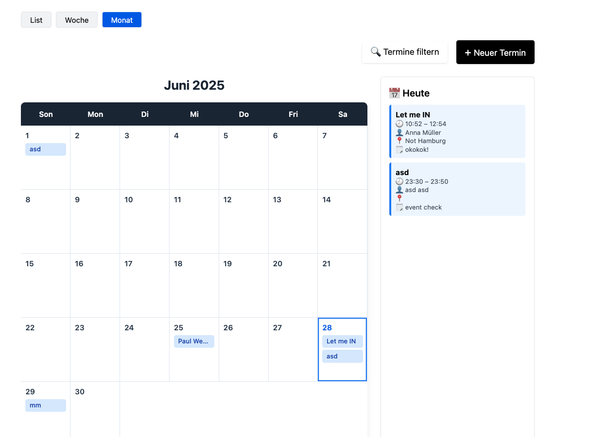
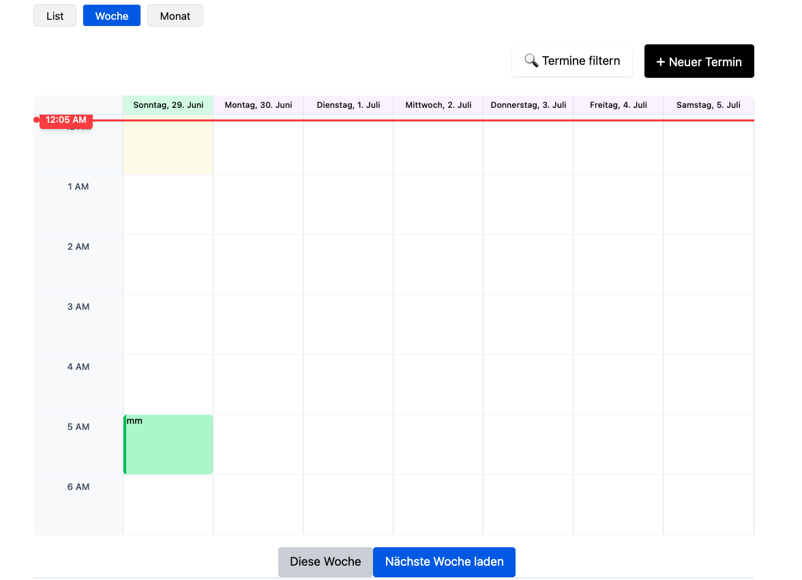
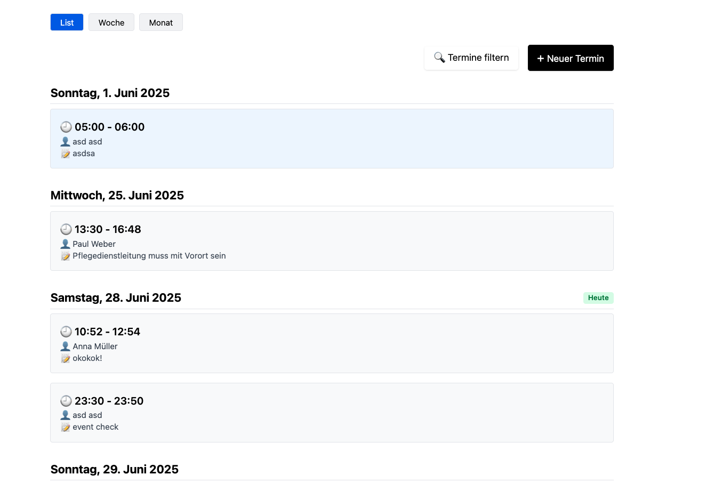
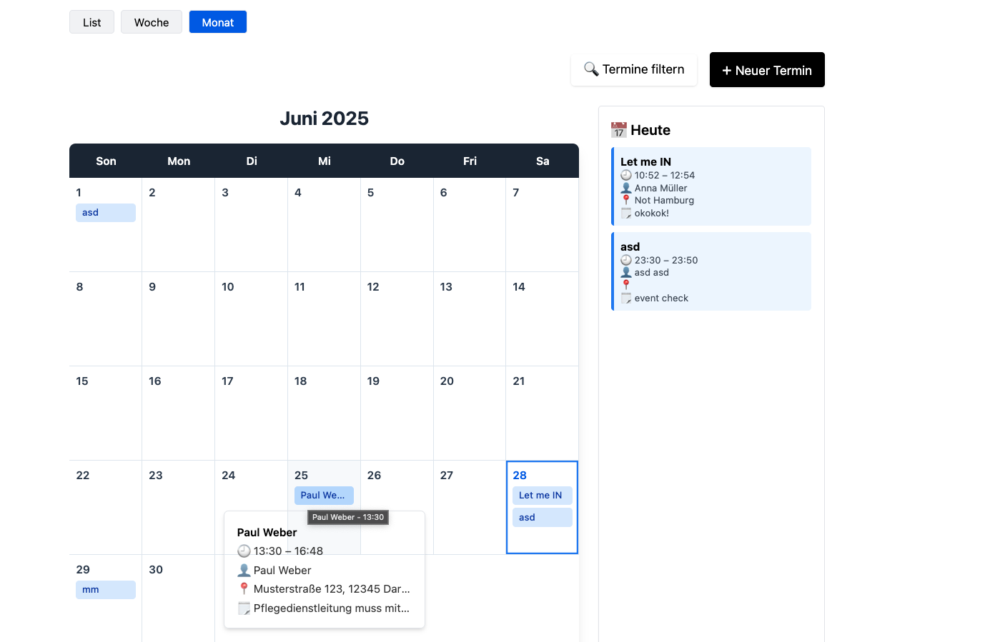
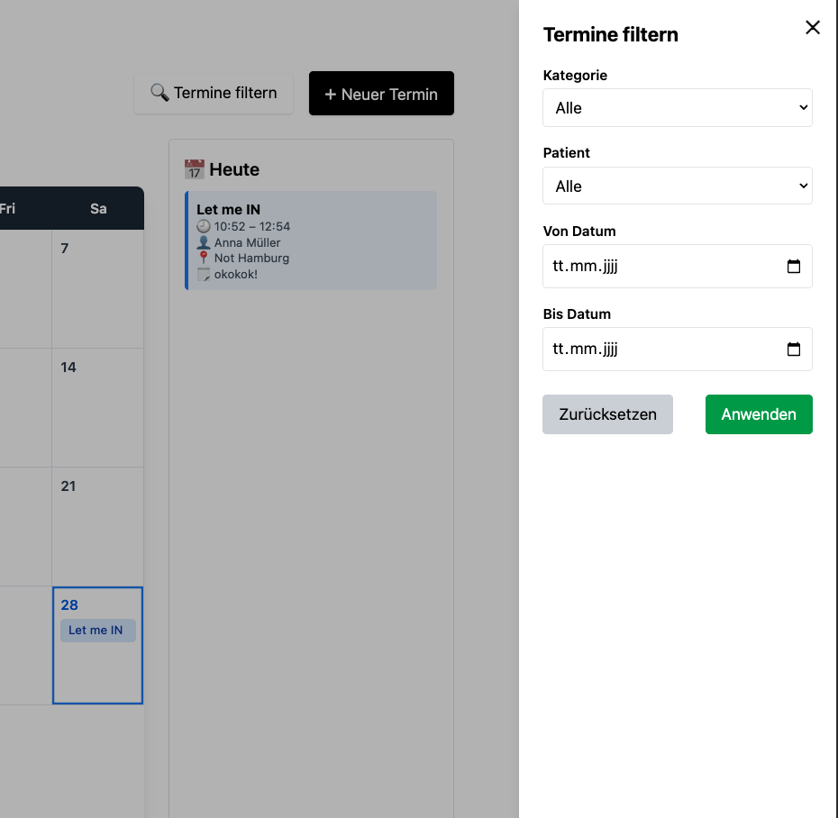
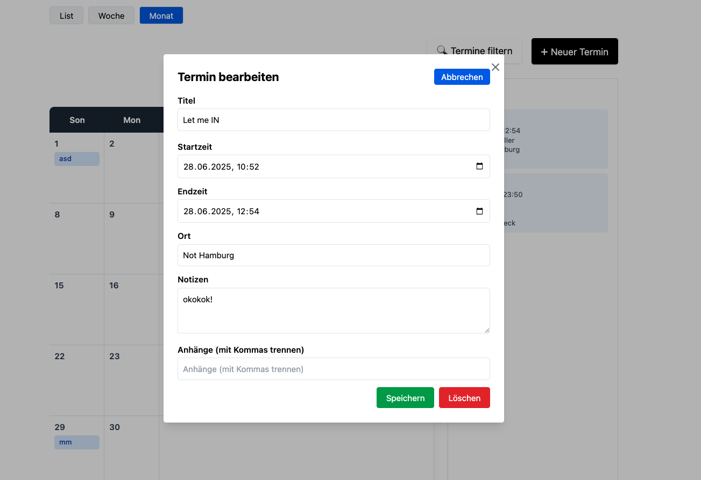
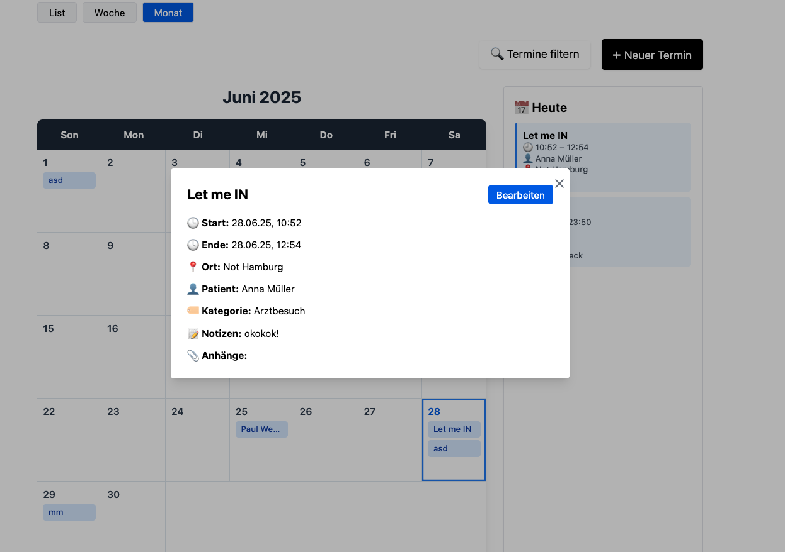
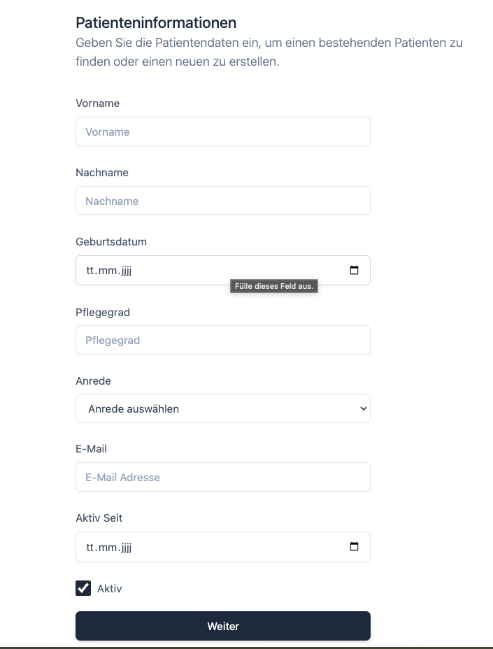
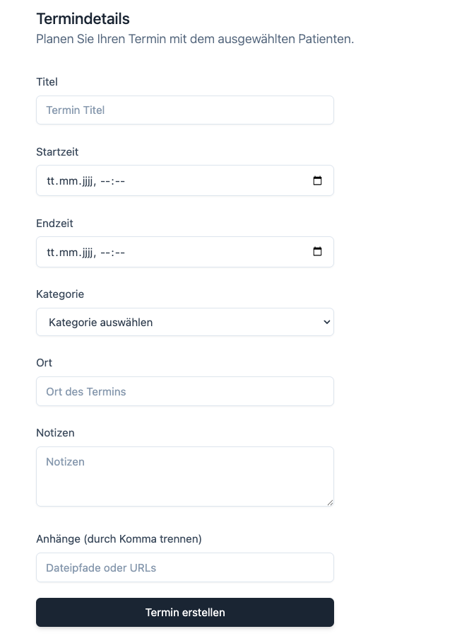

# 🗓️ CareCalendar — Patient Appointment Manager

CareCalendar is a calendar-based patient appointment management system built for healthcare providers, therapists, and care institutions. It includes support for calendar views, patient records, filtering, categories, and detailed appointment management.

---

## Features

- Month, Week, and List Views
- Link Appointments to Patients (with care level, pronouns, active status)
- Appointment Categories (with color, icon, description)
- Add Location, Notes, and Attachments
- Filter by Category, Patient, or Date Range
- Create, Edit, and Delete Appointments
- Modal-based Appointment View + Edit
- Hover Card Support (with shadcn)
- Fully Powered by Supabase

---

## Tech Stack

- **Frontend**: Next.js 14 (App Router) + Tailwind CSS
- **Backend**: Supabase (PostgreSQL)
- **UI Components**: shadcn/ui (Radix-based component library)
- **State Management**: React Hooks

---

## Setup Instructions

### 1. Clone the Project

```bash
git clone https://github.com/kiavashjamshidi/Appointments.git
cd carecalendar
```

### 2. Install Dependencies

```bash
npm install
```

### 3. Run Dev Server

```bash
npm run dev
```

### 4. Preview the App

You can access the app locally at [http://localhost:3000](http://localhost:3000) after starting the dev server.

Or view the live deployed version here:

[https://appointments-inky.vercel.app](https://appointments-inky.vercel.app)

---

## Screenshots

### Month View



### Week View



### List View



### Month View with Hover



### Filter Bar



### Appointment Edit Form



### Appointment Modal



### New Appointment Form



### New Appointment Page (Step 2)


